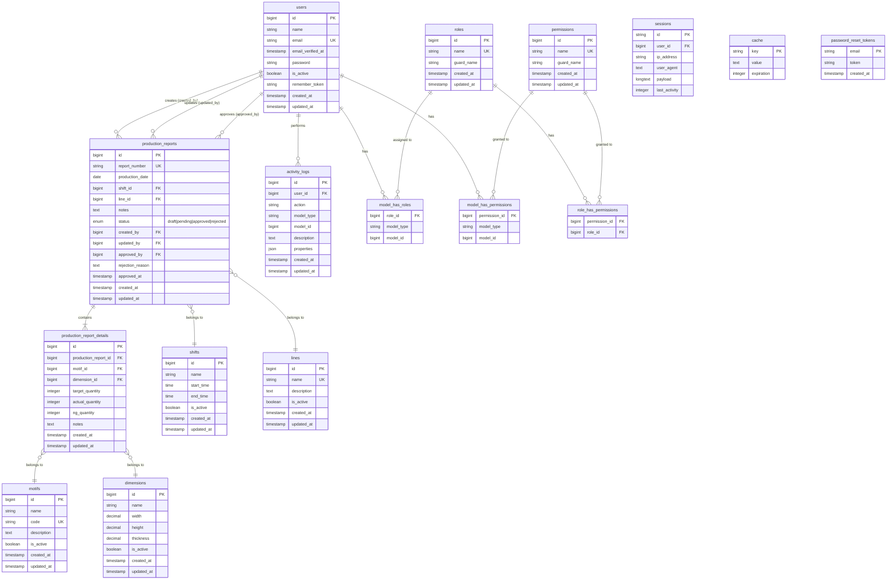

# Entity Relationship Diagram (ERD)
## PT Surya Multi Cemerlang - Production Report System

### Database Schema

---

## Table Descriptions

### Core Tables

#### 1. **users**
- Primary user management table
- Stores authentication and profile information
- Connected to roles and permissions via Spatie Permission
- Tracks user activity through activity_logs

**Key Relationships:**
- Creates production reports (created_by)
- Updates production reports (updated_by)
- Approves production reports (approved_by)
- Has roles and permissions

#### 2. **production_reports**
- Main transaction table for production reporting
- Tracks production by date, shift, and line
- Implements approval workflow (draft → pending → approved/rejected)
- Contains summary information for each production session

**Key Relationships:**
- Belongs to Shift (shift_id)
- Belongs to Line (line_id)
- Belongs to User (created_by, updated_by, approved_by)
- Has many ProductionReportDetails

#### 3. **production_report_details**
- Detail records for each production report
- Tracks specific motif and dimension combinations
- Records target, actual, and NG (Not Good) quantities
- Enables detailed production analysis

**Key Relationships:**
- Belongs to ProductionReport (production_report_id)
- Belongs to Motif (motif_id)
- Belongs to Dimension (dimension_id)

### Master Data Tables

#### 4. **lines**
- Production line master data
- Represents physical production lines in factory
- Used for resource allocation and tracking

#### 5. **motifs**
- Product motif/design master data
- Each ceramic product has a specific motif
- Includes code for identification

#### 6. **dimensions**
- Product dimension specifications
- Stores width, height, thickness measurements
- Example: 60x60, 50x50, 30x60, etc.

#### 7. **shifts**
- Work shift master data
- Defines shift schedule (Shift I, II, III)
- Includes start and end times

### Authorization Tables (Spatie Permission)

#### 8. **roles**
- Role definitions (Admin, Supervisor, Operator, Viewer)
- Used for role-based access control

#### 9. **permissions**
- Permission definitions for fine-grained access control
- Examples: create-report, approve-report, manage-users

#### 10. **model_has_roles**
- Pivot table linking users to roles
- Supports polymorphic relationships

#### 11. **model_has_permissions**
- Pivot table linking users to permissions
- Direct permission assignment

#### 12. **role_has_permissions**
- Pivot table linking roles to permissions
- Defines what permissions each role has

### Audit & Support Tables

#### 13. **activity_logs**
- Comprehensive audit trail
- Tracks all user actions and changes
- Stores JSON properties for detailed information

#### 14. **sessions**
- Laravel session management
- Tracks active user sessions

#### 15. **cache**
- Application cache storage
- Performance optimization

#### 16. **password_reset_tokens**
- Password reset functionality
- Security token management

---

## Key Indexes

### Production Reports
- `report_number` (unique)
- `production_date, shift_id, line_id` (composite)
- `status`

### Production Report Details
- `production_report_id`
- `motif_id`
- `dimension_id`

### Activity Logs
- `user_id`
- `model_type, model_id` (composite)
- `created_at`

---

## Data Constraints

### Foreign Key Constraints

| Table | Column | References | On Delete |
|-------|--------|------------|-----------|
| production_reports | shift_id | shifts.id | RESTRICT |
| production_reports | line_id | lines.id | RESTRICT |
| production_reports | created_by | users.id | RESTRICT |
| production_reports | updated_by | users.id | SET NULL |
| production_reports | approved_by | users.id | SET NULL |
| production_report_details | production_report_id | production_reports.id | CASCADE |
| production_report_details | motif_id | motifs.id | RESTRICT |
| production_report_details | dimension_id | dimensions.id | RESTRICT |
| activity_logs | user_id | users.id | CASCADE |

### Enum Values

| Column | Values |
|--------|--------|
| production_reports.status | draft, pending, approved, rejected |

---

## Database Statistics

- **Total Tables**: 16
- **Core Business Tables**: 8
- **Master Data Tables**: 4
- **Authorization Tables**: 5
- **Support Tables**: 3
- **Total Relationships**: 20+

---

Generated on: December 30, 2025
Version: 1.0.0
