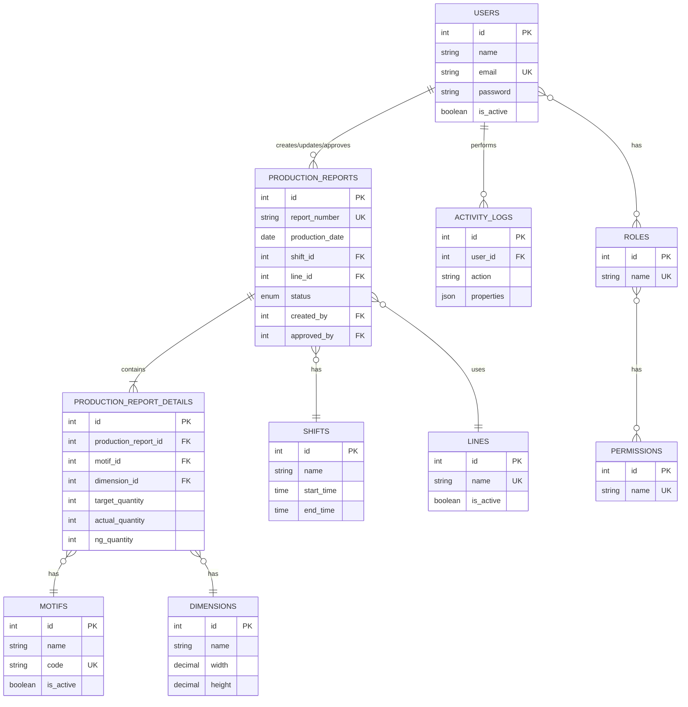
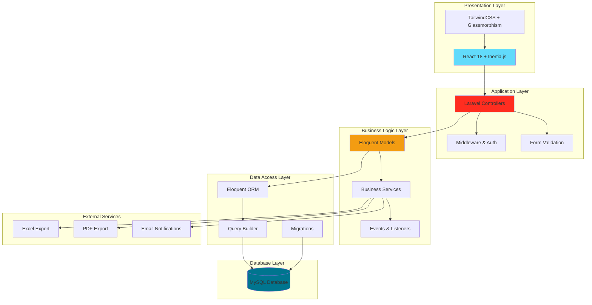
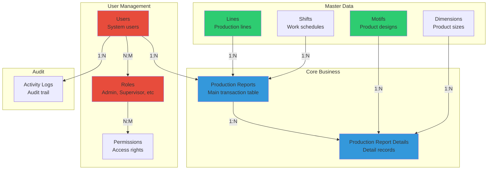
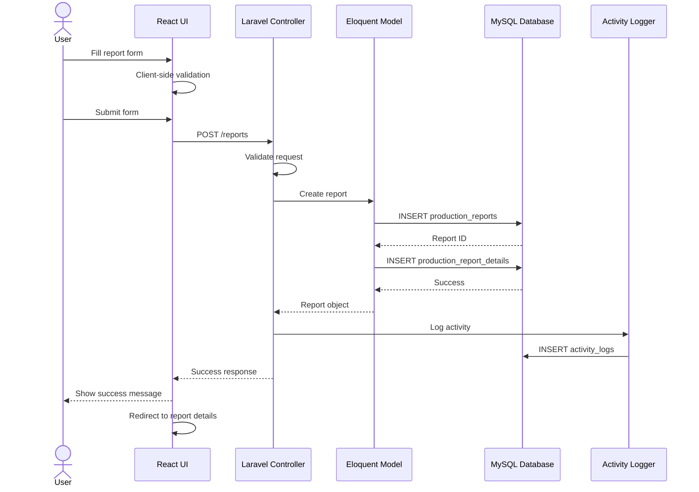
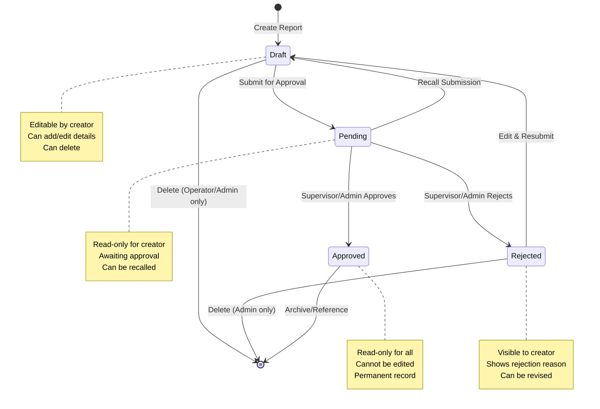
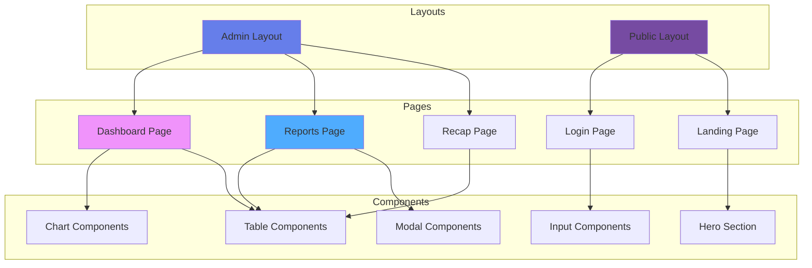
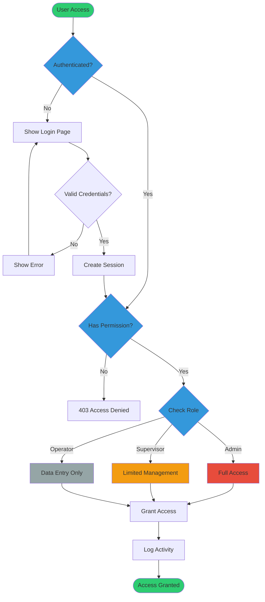
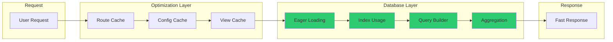
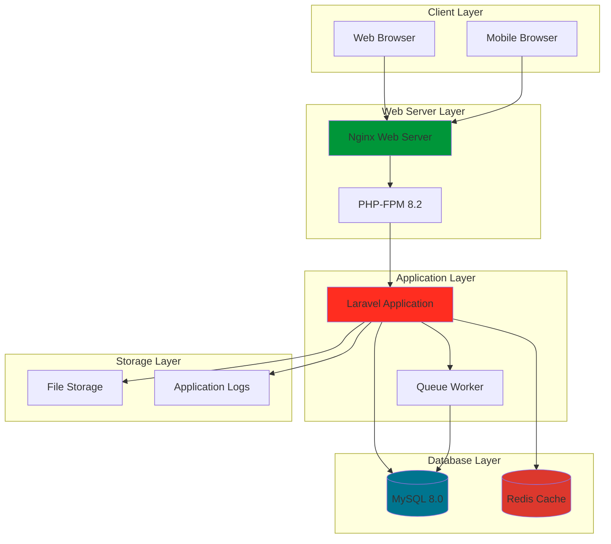

# System Architecture & UML Diagrams
## PT Surya Multi Cemerlang - Production Report System

## Table of Contents
1. [Entity Relationship Diagram (ERD)](#entity-relationship-diagram)
2. [Use Case Diagram](#use-case-diagram)
3. [System Architecture](#system-architecture)
4. [Database Schema Visual](#database-schema-visual)

---

## Entity Relationship Diagram

### Simplified ERD - Core Entities

---

## Use Case Diagram

### System Actors and Use Cases

```mermaid
%%{init: {'theme':'base'}}%%
graph LR
    subgraph System["Production Report System"]
        subgraph Auth["Authentication"]
            Login[Login]
            Logout[Logout]
            Profile[Manage Profile]
        end
        
        subgraph Reports["Production Reports"]
            CreateReport[Create Report]
            ViewReports[View Reports]
            EditReport[Edit Report]
            DeleteReport[Delete Report]
            SubmitApproval[Submit for Approval]
            ApproveReport[Approve/Reject Report]
            AddDetails[Add Report Details]
        end
        
        subgraph Dashboard["Dashboard & Analytics"]
            ViewDashboard[View Dashboard]
            ViewStats[View Statistics]
            ViewCharts[View Trend Charts]
        end
        
        subgraph Recap["Recap & Export"]
            ViewRecap[View Production Recap]
            FilterData[Filter by Date/Line/Motif]
            ExportExcel[Export to Excel]
            ExportPDF[Export to PDF]
        end
        
        subgraph Master["Master Data"]
            ManageLines[Manage Lines]
            ManageMotifs[Manage Motifs]
            ManageDimensions[Manage Dimensions]
            ManageShifts[Manage Shifts]
        end
        
        subgraph Users["User Management"]
            ManageUsers[Manage Users]
            AssignRoles[Assign Roles]
        end
        
        subgraph Audit["Monitoring"]
            ViewLogs[View Activity Logs]
            TrackChanges[Track Changes]
        end
    end
    
    Admin((Admin))
    Supervisor((Supervisor))
    Operator((Operator))
    
    Admin --> Login
    Admin --> CreateReport
    Admin --> ApproveReport
    Admin --> ViewDashboard
    Admin --> ManageLines
    Admin --> ManageUsers
    Admin --> ViewLogs
    Admin --> ExportExcel
    
    Supervisor --> Login
    Supervisor --> CreateReport
    Supervisor --> ApproveReport
    Supervisor --> ViewDashboard
    Supervisor --> ExportExcel
    Supervisor --> ViewLogs
    
    Operator --> Login
    Operator --> CreateReport
    Operator --> ViewReports
    Operator --> ViewDashboard
    
    style Admin fill:#ff6b6b
    style Supervisor fill:#4ecdc4
    style Operator fill:#95e1d3
```

---

## System Architecture

### Layered Architecture

---

## Database Schema Visual

### Core Tables Relationships

---

## Data Flow Diagram

### Production Report Creation Flow

---

## Approval Workflow

### Report Status State Machine

---

## Component Architecture

### Frontend Components

---

## Security Architecture

### Authentication & Authorization Flow

---

## Performance Optimization

### Query Optimization Strategy

---

## Deployment Architecture

### Production Environment

---

## Summary

### System Metrics

| Metric | Value |
|--------|-------|
| **Total Tables** | 16 |
| **Core Entities** | 8 |
| **Use Cases** | 32 |
| **User Roles** | 4 (Admin, Supervisor, Operator, Viewer) |
| **Main Features** | 7 modules |
| **Technology Stack** | Laravel 11 + React 18 + MySQL |
| **Security Layers** | 3 (Authentication, Authorization, Audit) |

### Key Features Summary

1. ✅ **Multi-Role Authentication** - Secure role-based access
2. ✅ **Production Management** - Complete CRUD with approval workflow
3. ✅ **Real-time Dashboard** - Interactive charts and statistics
4. ✅ **Flexible Reporting** - Advanced filters and export capabilities
5. ✅ **Master Data Management** - Centralized configuration
6. ✅ **Activity Tracking** - Comprehensive audit trail
7. ✅ **Modern UI/UX** - Glassmorphism design with responsive layout

---

**Document Version:** 1.0.0  
**Last Updated:** December 30, 2025  
**System:** PT Surya Multi Cemerlang Production Report System  
**Prepared by:** Development Team
