# Use Case Diagram
## PT Surya Multi Cemerlang - Production Report System

### System Overview

```mermaid
graph TB
    subgraph "Production Report System"
        subgraph "Authentication & Authorization"
            UC1[Login]
            UC2[Logout]
            UC3[Manage Profile]
        end
        
        subgraph "Production Reports Management"
            UC4[Create Production Report]
            UC5[View Production Reports]
            UC6[Edit Production Report]
            UC7[Delete Production Report]
            UC8[Submit for Approval]
            UC9[Approve/Reject Report]
            UC10[Add Report Details]
            UC11[View Report Details]
        end
        
        subgraph "Dashboard & Analytics"
            UC12[View Dashboard]
            UC13[View Production Statistics]
            UC14[View Trend Charts]
            UC15[View Latest Reports]
        end
        
        subgraph "Recap & Reporting"
            UC16[View Production Recap]
            UC17[Filter by Date Range]
            UC18[Filter by Line/Motif/Dimension]
            UC19[Export to Excel]
            UC20[Export to PDF]
        end
        
        subgraph "Master Data Management"
            UC21[Manage Lines]
            UC22[Manage Motifs]
            UC23[Manage Dimensions]
            UC24[Manage Shifts]
            UC25[CRUD Operations]
        end
        
        subgraph "User Management"
            UC26[Manage Users]
            UC27[Assign Roles]
            UC28[Set User Status]
            UC29[Reset Password]
        end
        
        subgraph "Activity Monitoring"
            UC30[View Activity Logs]
            UC31[Track Changes]
            UC32[Audit Trail]
        end
    end
    
    Admin((Admin))
    Supervisor((Supervisor))
    Operator((Operator))
    Guest((Guest/Visitor))
    
    Admin --> UC1
    Admin --> UC2
    Admin --> UC3
    Admin --> UC4
    Admin --> UC5
    Admin --> UC6
    Admin --> UC7
    Admin --> UC8
    Admin --> UC9
    Admin --> UC10
    Admin --> UC11
    Admin --> UC12
    Admin --> UC13
    Admin --> UC14
    Admin --> UC15
    Admin --> UC16
    Admin --> UC17
    Admin --> UC18
    Admin --> UC19
    Admin --> UC20
    Admin --> UC21
    Admin --> UC22
    Admin --> UC23
    Admin --> UC24
    Admin --> UC25
    Admin --> UC26
    Admin --> UC27
    Admin --> UC28
    Admin --> UC29
    Admin --> UC30
    Admin --> UC31
    Admin --> UC32
    
    Supervisor --> UC1
    Supervisor --> UC2
    Supervisor --> UC3
    Supervisor --> UC4
    Supervisor --> UC5
    Supervisor --> UC6
    Supervisor --> UC8
    Supervisor --> UC9
    Supervisor --> UC10
    Supervisor --> UC11
    Supervisor --> UC12
    Supervisor --> UC13
    Supervisor --> UC14
    Supervisor --> UC15
    Supervisor --> UC16
    Supervisor --> UC17
    Supervisor --> UC18
    Supervisor --> UC19
    Supervisor --> UC20
    Supervisor --> UC30
    
    Operator --> UC1
    Operator --> UC2
    Operator --> UC3
    Operator --> UC4
    Operator --> UC5
    Operator --> UC6
    Operator --> UC8
    Operator --> UC10
    Operator --> UC11
    Operator --> UC12
    Operator --> UC16
    
    Guest --> UC1
```

---

## Actor Descriptions

### 1. **Admin**
**Primary Role:** System Administrator

**Responsibilities:**
- Full system access
- User management
- Master data configuration
- System monitoring and maintenance
- Access to all features without restriction

**Key Activities:**
- Create, edit, delete all production reports
- Approve or reject reports
- Manage users and assign roles
- Configure master data (Lines, Motifs, Dimensions, Shifts)
- View all analytics and reports
- Monitor system activity logs

---

### 2. **Supervisor**
**Primary Role:** Production Supervisor

**Responsibilities:**
- Production oversight
- Report approval
- Team monitoring
- Quality control validation

**Key Activities:**
- Create and edit production reports
- Approve or reject submitted reports
- View production analytics and trends
- Export production data
- Monitor team activities
- Access all production reports

**Restrictions:**
- Cannot manage users
- Cannot modify master data
- Cannot delete approved reports

---

### 3. **Operator**
**Primary Role:** Production Line Operator

**Responsibilities:**
- Daily production data entry
- Report creation for assigned shift
- Update production details

**Key Activities:**
- Create new production reports
- Edit own draft reports
- Submit reports for approval
- View own reports
- Access basic dashboard
- View production recap

**Restrictions:**
- Cannot approve reports
- Cannot delete reports
- Cannot manage users
- Cannot modify master data
- Limited access to other users' reports

---

### 4. **Guest/Visitor**
**Primary Role:** Unauthenticated User

**Responsibilities:**
- View public information
- Access login page

**Key Activities:**
- View landing page
- Access login form
- View company information

**Restrictions:**
- No access to system features
- Must login to access any functionality

---

## Detailed Use Cases

### Authentication & Authorization

#### UC1: Login
**Actor:** All Users  
**Description:** User authenticates to access the system  
**Preconditions:** User has valid credentials  
**Postconditions:** User is authenticated and redirected to dashboard  

**Main Flow:**
1. User navigates to login page
2. System displays glassmorphism login form
3. User enters email and password
4. User optionally checks "Remember Me"
5. User clicks "Login" button
6. System validates credentials
7. System creates session
8. System redirects to appropriate dashboard based on role

**Alternative Flow:**
- Invalid credentials: Show error message
- Inactive user: Deny access and show message
- Session expired: Redirect to login

---

#### UC2: Logout
**Actor:** All Authenticated Users  
**Description:** User terminates their session  
**Preconditions:** User is logged in  
**Postconditions:** Session is destroyed, user is redirected to landing page  

---

#### UC3: Manage Profile
**Actor:** All Authenticated Users  
**Description:** User views and updates their profile information  
**Preconditions:** User is logged in  
**Postconditions:** Profile information is updated  

---

### Production Reports Management

#### UC4: Create Production Report
**Actor:** Admin, Supervisor, Operator  
**Description:** User creates a new production report  
**Preconditions:** User has create permission, master data exists  
**Postconditions:** New report is created in draft status  

**Main Flow:**
1. User navigates to "Create Report" page
2. System displays report form
3. User selects production date
4. User selects shift
5. User selects line
6. User adds optional notes
7. User clicks "Save as Draft"
8. System generates unique report number
9. System saves report
10. System redirects to report details

**Alternative Flow:**
- User clicks "Cancel": Return to reports list
- Validation errors: Show error messages

---

#### UC5: View Production Reports
**Actor:** Admin, Supervisor, Operator  
**Description:** User views list of production reports  
**Preconditions:** User is logged in  
**Postconditions:** Reports are displayed according to user permissions  

**Main Flow:**
1. User navigates to "Reports" page
2. System loads reports based on user role:
   - Admin/Supervisor: All reports
   - Operator: Own reports
3. System displays paginated list with filters
4. User can filter by date, status, line, shift
5. User can search by report number
6. User can sort columns

---

#### UC6: Edit Production Report
**Actor:** Admin, Supervisor, Operator  
**Description:** User modifies an existing production report  
**Preconditions:** Report is in draft or pending status, user has permission  
**Postconditions:** Report is updated with changes  

**Main Flow:**
1. User opens report details
2. User clicks "Edit" button
3. System displays editable form
4. User modifies fields
5. User saves changes
6. System updates report
7. System logs activity

**Alternative Flow:**
- Report is approved: Edit button disabled
- User lacks permission: Edit button hidden

---

#### UC7: Delete Production Report
**Actor:** Admin  
**Description:** Admin deletes a production report  
**Preconditions:** User is admin, report is in draft status  
**Postconditions:** Report is permanently deleted  

**Main Flow:**
1. User selects report to delete
2. User clicks "Delete" button
3. System shows confirmation dialog
4. User confirms deletion
5. System deletes report and all details
6. System logs activity
7. System shows success message

---

#### UC8: Submit for Approval
**Actor:** Admin, Supervisor, Operator  
**Description:** User submits draft report for supervisor approval  
**Preconditions:** Report is in draft status, has at least one detail  
**Postconditions:** Report status changes to "pending"  

**Main Flow:**
1. User opens draft report
2. User clicks "Submit for Approval"
3. System validates report completeness
4. System changes status to "pending"
5. System logs activity
6. System notifies supervisors

---

#### UC9: Approve/Reject Report
**Actor:** Admin, Supervisor  
**Description:** Supervisor approves or rejects a pending report  
**Preconditions:** Report is in pending status, user has approval permission  
**Postconditions:** Report status changes to approved or rejected  

**Main Flow (Approval):**
1. Supervisor opens pending report
2. Supervisor reviews details
3. Supervisor clicks "Approve" button
4. System updates status to "approved"
5. System records approver and timestamp
6. System logs activity
7. System notifies report creator

**Alternative Flow (Rejection):**
1. Supervisor clicks "Reject" button
2. System shows rejection reason dialog
3. Supervisor enters reason
4. System updates status to "rejected"
5. System records rejection details
6. System notifies report creator

---

#### UC10: Add Report Details
**Actor:** Admin, Supervisor, Operator  
**Description:** User adds production detail lines to a report  
**Preconditions:** Report exists, report is not approved  
**Postconditions:** Detail records are added to report  

**Main Flow:**
1. User opens report details page
2. User clicks "Add Detail" button
3. System shows detail form modal
4. User selects motif
5. User selects dimension
6. User enters target quantity
7. User enters actual quantity
8. User enters NG quantity
9. User adds optional notes
10. User saves detail
11. System validates and saves
12. System updates report totals

---

#### UC11: View Report Details
**Actor:** Admin, Supervisor, Operator  
**Description:** User views detailed information of a production report  
**Preconditions:** User has view permission for the report  
**Postconditions:** Report details are displayed  

**Main Flow:**
1. User clicks on report from list
2. System loads report with all details
3. System displays:
   - Report header information
   - Production details table
   - Totals and calculations
   - Status and approval info
   - Action buttons based on permissions

---

### Dashboard & Analytics

#### UC12: View Dashboard
**Actor:** Admin, Supervisor, Operator  
**Description:** User views production dashboard with statistics  
**Preconditions:** User is logged in  
**Postconditions:** Dashboard is displayed with relevant data  

**Main Flow:**
1. User logs in or clicks "Dashboard"
2. System loads dashboard data
3. System displays:
   - Total production summary
   - Defect rate statistics
   - 7-day trend chart
   - Latest reports
   - Quick action buttons
4. Data is filtered based on user role

---

#### UC13: View Production Statistics
**Actor:** Admin, Supervisor, Operator  
**Description:** User views production statistics and KPIs  
**Preconditions:** User is logged in  
**Postconditions:** Statistics are displayed  

---

#### UC14: View Trend Charts
**Actor:** Admin, Supervisor, Operator  
**Description:** User views interactive production trend charts  
**Preconditions:** User is logged in, data exists  
**Postconditions:** Charts are rendered with production data  

---

#### UC15: View Latest Reports
**Actor:** Admin, Supervisor, Operator  
**Description:** User views list of latest production reports  
**Preconditions:** User is logged in  
**Postconditions:** Recent reports are displayed  

---

### Recap & Reporting

#### UC16: View Production Recap
**Actor:** Admin, Supervisor, Operator  
**Description:** User views production recap with filters  
**Preconditions:** User is logged in  
**Postconditions:** Recap data is displayed  

**Main Flow:**
1. User navigates to "Recap" page
2. System displays recap interface
3. User sets date range (start and end date)
4. User optionally filters by line, motif, dimension
5. User clicks "Apply Filters"
6. System queries and aggregates data
7. System displays summary table
8. System shows totals and statistics

---

#### UC17: Filter by Date Range
**Actor:** Admin, Supervisor, Operator  
**Description:** User filters recap data by date range  
**Preconditions:** User is on recap page  
**Postconditions:** Data is filtered to selected date range  

---

#### UC18: Filter by Line/Motif/Dimension
**Actor:** Admin, Supervisor, Operator  
**Description:** User applies filters to recap data  
**Preconditions:** User is on recap page  
**Postconditions:** Data is filtered according to selections  

---

#### UC19: Export to Excel
**Actor:** Admin, Supervisor, Operator  
**Description:** User exports production data to Excel file  
**Preconditions:** User is viewing filtered recap data  
**Postconditions:** Excel file is downloaded  

**Main Flow:**
1. User sets desired filters
2. User clicks "Export to Excel" button
3. System generates Excel file with:
   - Filtered production data
   - Summary calculations
   - Formatted tables
   - Company branding
4. System initiates file download
5. User saves Excel file

---

#### UC20: Export to PDF
**Actor:** Admin, Supervisor  
**Description:** User exports production report to PDF  
**Preconditions:** User has export permission  
**Postconditions:** PDF file is downloaded  

---

### Master Data Management

#### UC21: Manage Lines
**Actor:** Admin  
**Description:** Admin manages production line master data  
**Preconditions:** User is admin  
**Postconditions:** Line data is created/updated/deleted  

**CRUD Operations:**
- Create new line
- View line list
- Edit line information
- Activate/deactivate line
- View line usage in reports

---

#### UC22: Manage Motifs
**Actor:** Admin  
**Description:** Admin manages product motif master data  
**Preconditions:** User is admin  
**Postconditions:** Motif data is managed  

---

#### UC23: Manage Dimensions
**Actor:** Admin  
**Description:** Admin manages product dimension master data  
**Preconditions:** User is admin  
**Postconditions:** Dimension data is managed  

---

#### UC24: Manage Shifts
**Actor:** Admin  
**Description:** Admin manages work shift master data  
**Preconditions:** User is admin  
**Postconditions:** Shift data is managed  

---

#### UC25: CRUD Operations
**Actor:** Admin  
**Description:** Standard create, read, update, delete operations for master data  
**Preconditions:** User is admin  
**Postconditions:** Master data is modified  

---

### User Management

#### UC26: Manage Users
**Actor:** Admin  
**Description:** Admin manages system users  
**Preconditions:** User is admin  
**Postconditions:** User accounts are managed  

**Main Flow:**
1. Admin navigates to "User Management"
2. System displays user list
3. Admin can:
   - Create new user
   - Edit user information
   - Activate/deactivate user
   - Reset user password
   - Assign roles

---

#### UC27: Assign Roles
**Actor:** Admin  
**Description:** Admin assigns roles to users  
**Preconditions:** User is admin, roles exist  
**Postconditions:** User roles are updated  

**Available Roles:**
- Admin: Full system access
- Supervisor: Production oversight and approval
- Operator: Production data entry
- Viewer: Read-only access

---

#### UC28: Set User Status
**Actor:** Admin  
**Description:** Admin activates or deactivates user accounts  
**Preconditions:** User is admin  
**Postconditions:** User status is updated  

---

#### UC29: Reset Password
**Actor:** Admin  
**Description:** Admin resets user password  
**Preconditions:** User is admin  
**Postconditions:** User password is reset  

---

### Activity Monitoring

#### UC30: View Activity Logs
**Actor:** Admin, Supervisor  
**Description:** User views system activity logs  
**Preconditions:** User has monitoring permission  
**Postconditions:** Activity logs are displayed  

**Main Flow:**
1. User navigates to "Activity Logs"
2. System displays log entries
3. User can filter by:
   - Date range
   - User
   - Action type
   - Model type
4. System shows:
   - Timestamp
   - User who performed action
   - Action description
   - Changed properties

---

#### UC31: Track Changes
**Actor:** Admin, Supervisor  
**Description:** User tracks changes to specific records  
**Preconditions:** User has monitoring permission  
**Postconditions:** Change history is displayed  

---

#### UC32: Audit Trail
**Actor:** Admin  
**Description:** Admin reviews comprehensive audit trail  
**Preconditions:** User is admin  
**Postconditions:** Full audit information is displayed  

---

## Use Case Relationships

### Include Relationships
- UC4 (Create Report) **includes** UC10 (Add Report Details)
- UC16 (View Recap) **includes** UC17 (Filter by Date Range)
- UC16 (View Recap) **includes** UC18 (Filter by Line/Motif/Dimension)

### Extend Relationships
- UC8 (Submit for Approval) **extends** UC4 (Create Report)
- UC19 (Export to Excel) **extends** UC16 (View Recap)
- UC20 (Export to PDF) **extends** UC5 (View Reports)

### Generalization
- UC21, UC22, UC23, UC24 **generalize to** UC25 (CRUD Operations)
- UC30, UC31 **generalize to** UC32 (Audit Trail)

---

## System Boundaries

### In Scope
✅ Production report management  
✅ Role-based access control  
✅ Dashboard and analytics  
✅ Master data management  
✅ User management  
✅ Activity logging  
✅ Data export functionality  

### Out of Scope
❌ Inventory management  
❌ Financial reporting  
❌ External system integration  
❌ Mobile native application  
❌ Real-time machine monitoring  
❌ Automated quality testing  

---

## Non-Functional Requirements

### Performance
- Dashboard load time: < 1 second
- Report list pagination: 50 items per page
- Export generation: < 5 seconds for 1000 records

### Security
- Password hashing with bcrypt
- CSRF protection
- SQL injection prevention
- XSS protection
- Role-based authorization

### Usability
- Modern glassmorphism UI
- Responsive design (mobile-first)
- Intuitive navigation
- Clear error messages
- Loading indicators

### Reliability
- 99.5% uptime target
- Automatic backup daily
- Session timeout: 2 hours
- Error logging and monitoring

---

Generated on: December 30, 2025  
Version: 1.0.0  
System: PT Surya Multi Cemerlang Production Report System
